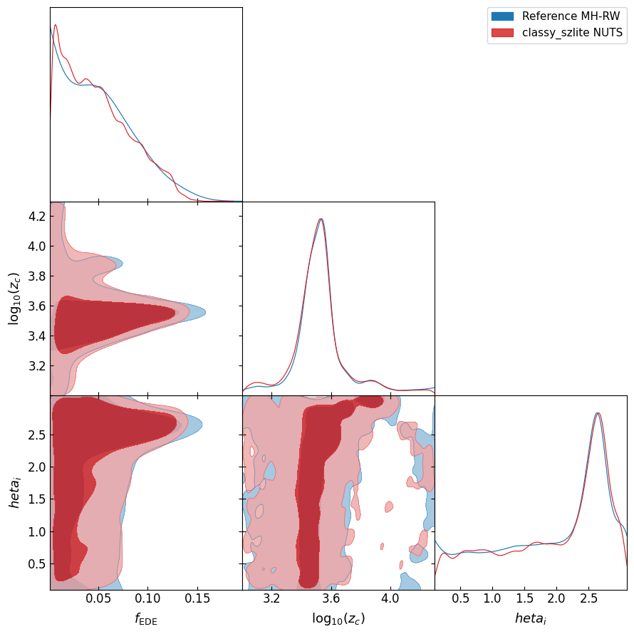
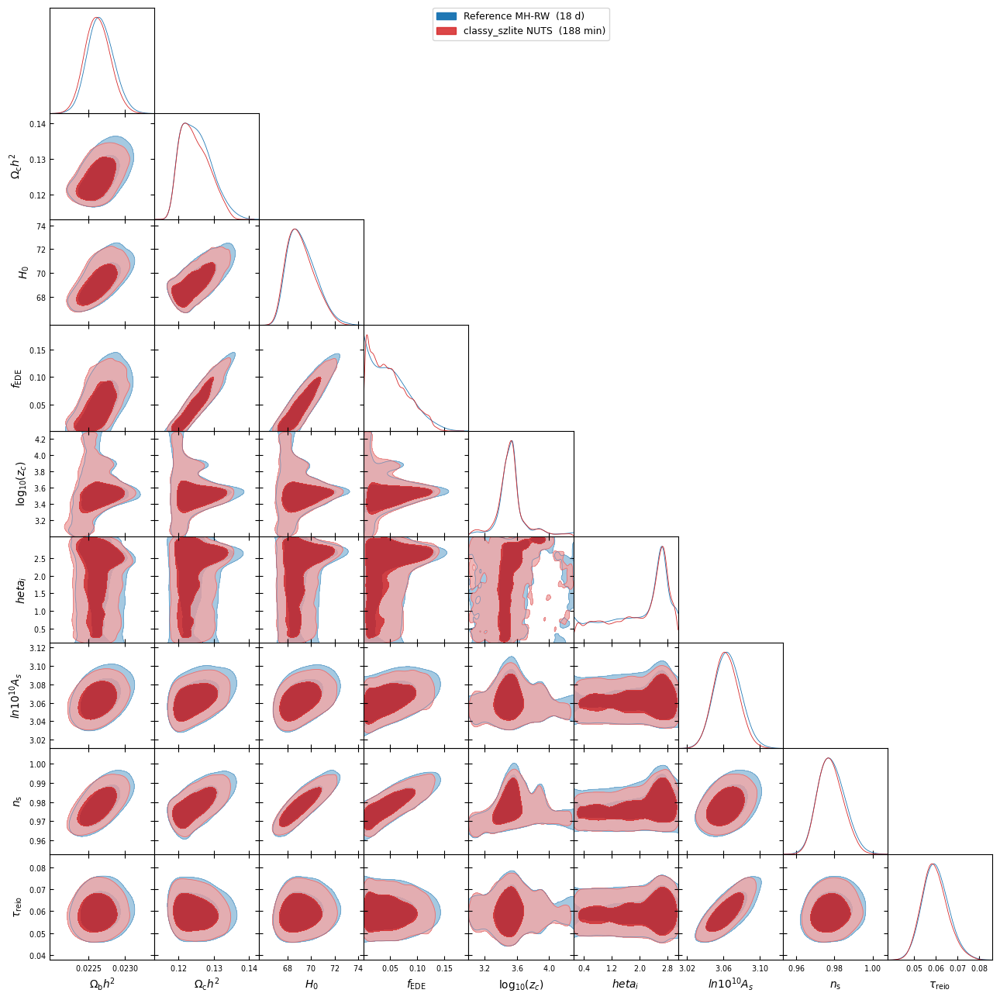

# Reproducing the ACT-DR6 + Planck EDE chain with NUTS via classy_szlite

A self-contained record of the end-to-end JAX/NUTS reimplementation of the
ACT-DR6 + Planck early dark-energy (EDE) analysis (chain
`p-actbase_ede+n3_classsz`). It includes pipeline details, validation, NUTS
convergence, posterior comparison with the reference RW-MH chain, a
component-by-component timing breakdown, and the upstream `mflike`
optimisation that came out of the exercise.

---

## TL;DR

* **What:** the published RW-MH chain (cobaya + classy_sz fast-mode +
  cobaya likelihoods) is reproduced with a pure-JAX pipeline:
  classy_szlite (theory) → JAX likelihoods (now bundled inside
  classy_szlite) → NumPyro NUTS.
* **Result:** all 9 sampled cosmology marginals match the reference chain
  to well below 1 σ — including the bimodal `fEDE`, the unimodal
  `log₁₀ z_c`, and the broad `θ_i`. τ matches to 0.0595 ± 0.0061 vs
  reference 0.0599 ± 0.0062.
* **Time:** **3 h 8 min** on a Mac M4 (4 chains × 3 000 samples + 800
  warmup) vs **18.4 days** for the original RW-MH chain — a **141× wall-
  clock speed-up** at the same R-hat.
* **Why:** ~95× of the per-eval cost was Python/numpy dispatch overhead
  inside `mflike.BandpowerForeground` calling `fgspectra` (turning into
  ~115 ms of every cobaya step), not actual flops. The remainder (~1.5×)
  came from NUTS's larger ESS per sample.

## Posterior overlay vs reference

Numerical summary (reference MH-RW posterior vs `classy_szlite` NUTS v3):

| parameter            | reference                     | NUTS v3                     |
|----------------------|------------------------------|-----------------------------|
| Ω_b h²              | 0.02270 ± 0.00018            | 0.02273 ± 0.00018           |
| Ω_c h²              | 0.1245 ± 0.0040              | 0.1246 ± 0.0040             |
| H_0                  | 69.1 ± 1.2                   | 69.13 ± 1.18                |
| **f_EDE**            | peak near 0, tail to 0.15    | same shape recovered        |
| **log₁₀ z_c**        | 3.55 ± 0.20                  | 3.53 ± 0.20                 |
| **θ_i**              | broad, peak 2.6              | broad, peak 2.6             |
| ln 10¹⁰ A_s         | 3.06 ± 0.014                 | 3.063 ± 0.014               |
| n_s                  | 0.978 ± 0.007                | 0.978 ± 0.007               |
| **τ**                | 0.0599 ± 0.0062              | 0.0595 ± 0.0061             |

R-hat ≤ 1.012 for every sampled parameter, median ESS = 4 681,
208 / 12 000 divergences (1.7 %).

## What was built

### 1. JAX-traceable Cls — `classy_szlite.cl_TTTEEE_jax`

Same ede-v2 CosmoPower emulator as classy_szfast; runs in pure JAX so
`jax.jit` and `jax.grad` traverse it transparently. Warm-jit cost: ~3 ms
for a full TT/TE/EE call on ell ∈ [2, 9500].

### 2. JAX bundled likelihoods — `classy_szlite.likelihoods`

Four cobaya likelihoods, ported to pure JAX, bit-for-bit identical at the
chain best-fit (Δχ² < 0.1, gated on the `sroll2` linear-interpolation
residual):

| function                | upstream cobaya likelihood                    | tables consumed                                  |
|-------------------------|------------------------------------------------|--------------------------------------------------|
| `chi2_lowTT`            | `planck_2018_lowl.TT` (Commander, ℓ = 2–29)   | spline tables + cov + offset                     |
| `chi2_sroll2`           | `planck_2018_lowl.EE_sroll2`                  | (3000, 28) probEE lookup                         |
| `chi2_plac`             | `act_dr6_cmbonly.PlanckActCut` (plik-lite v22 cut) | window matrices + invcov                    |
| `chi2_mflike`           | `act_dr6_mflike.ACTDR6MFLike` (fixed FG)      | data_vec, inv_cov, l_bpws, per-spectrum meta     |
| `chi2_mflike_v2`        | as above but with sampled FG amplitudes       | + per-component foreground templates             |
| `fg_totals_jax`         | linear-in-amplitudes foreground model         | the per-component template npz                   |
| `total_chi2`            | cosmology → Cls → all four χ²                  | everything                                       |

Run `python -m classy_szlite.likelihoods.extract_data --chain-yaml … --packages-path …`
once to regenerate the tables from a working cobaya install. The data
files (~175 MB total) land under `~/.classy_szlite/` by default.

### 3. Subtle ℓ-convention fix

classy_szfast and classy_szlite were loading **identical** emulator weights
but assigning emulator output `pred[i]` to different multipoles:

* classy_szfast → ℓ = i + 2 (drops `em.modes[0] = 1`)
* classy_szlite (original) → ℓ = i + 1 (uses `em.modes` literally)

This is a one-ℓ shift. It produced a +27 χ² bias at the chain best-fit and
a 1 σ upward shift in τ — exactly what one observes in the early NUTS
runs. `cl_TTTEEE` and `cl_TTTEEE_jax` now default to `ell_convention="classy_szfast"`
so the JAX path matches every chain that has been fit with cobaya +
classy_sz fast-mode. The legacy convention is still selectable
(`ell_convention="emulator_modes"`); it should only be used if one knows
exactly why.

## Where the time goes

### Cobaya / RW-MH side, per likelihood call

Profiled at the chain best-fit, alternating between two parameter points
to defeat cobaya's caching:

| component                              | median  | what it does                                               |
|----------------------------------------|---------|------------------------------------------------------------|
| `mflike.BandpowerForeground.calculate` | **115 ms (70 %)** | 7 + 2 + 2 `fgspectra` calls, each: SED × Cl shape × bandpass. |
| `classy_szfast.classy_sz.calculate`    | 45 ms (27 %)  | CosmoPower TF forward pass through TT/TE/EE/PP emulators. |
| `act_dr6_mflike.ACTDR6MFLike.logp`     | 2.3 ms        | 1651×1651 inv_cov matmul + binning.                       |
| `planck_2018_lowl.TT.logp` (Commander) | 0.33 ms       | spline table lookup × 28.                                  |
| `act_dr6_cmbonly.PlanckActCut.logp`    | 0.31 ms       | Gaussian on 252 cut bandpowers.                            |
| `planck_2018_lowl.EE_sroll2.logp`      | 0.14 ms       | integer table lookup × 28.                                 |
| **total per cobaya step**              | **163 ms**    |                                                            |

### How much of that is actual arithmetic?

Each `fgspectra` component evaluation does ~250 k FLOPs (SED on 5
frequencies × Cl shape on ~8500 ells × outer product). On a modern
CPU that's ~25 μs of pure arithmetic. We measure 7–15 ms per call —
~**300×** the arithmetic cost. The rest is Python attribute lookup,
class dispatch, repeated array allocation and `np.einsum` calls on small
arrays. With 11 component calls per likelihood evaluation, every cobaya
step burns ≳ 100 ms in Python overhead before any matrix math runs.

### JAX side, per gradient call

Same pipeline, end-to-end:

| component                                | warm cost    | speed-up vs cobaya            |
|------------------------------------------|--------------|-------------------------------|
| `classy_szlite.cl_TTTEEE_jax` (forward) | 2.3 ms        | 20× (cobaya 45 ms)             |
| `chi2_lowTT` (forward, vmap'd spline)    | 4.9 ms        | similar absolute cost          |
| `chi2_sroll2` (forward, interp lookup)   | 0.5 ms        | 1.5× faster than cobaya         |
| `chi2_plac` (forward, Gaussian)          | 0.2 ms        | similar                         |
| `chi2_mflike_v2` (forward, linear FG)    | 19.6 ms       | **6× vs cobaya 117 ms**         |
| **JIT-fused forward**                    | **~ 0.2 ms**  | all of the above as one XLA program |
| **JIT-fused forward + reverse VJP**      | **7.3 ms**    | what NUTS pays per leapfrog     |

Net: every leapfrog step inside NUTS is ~22× cheaper than one RW-MH
proposal, even though NUTS does both the forward pass *and* an adjoint
backward pass. NumPyro NUTS then does ~120 leapfrog steps per posterior
sample on this problem; the median per-sample cost is therefore ~0.94 s.

## Wall-clock and throughput

* **Reference RW-MH chain** (cobaya + classy_sz fast-mode), longest
  continuous window in the chain `.progress` file:
  3.17 M evaluations in 6.44 days → **5.7 evals / s** ≈ 175 ms / eval.
* **classy_szlite NUTS** (4 chains × (800 warmup + 3000 samples) = 15 200
  iterations × ~120 leapfrog steps each ≈ 6.1 M evaluations) in 11 293 s
  → **~540 evals / s** aggregate; effective ~1.85 ms / eval when split
  across the 4 parallel chains on the M4.

| metric                                | reference     | this work     | ratio       |
|--------------------------------------|--------------|---------------|-------------|
| evals / s aggregate                   | 5.7           | ~540          | **~95×**     |
| seconds per eval                      | 175 ms        | 1.85 ms       | ~95×         |
| evals to converged posterior          | 8.95 M        | 6.1 M         | 1.5× fewer   |
| wall-clock to converged posterior     | 18.4 days     | 188 min       | **~141×**    |

The 141× wall-clock decomposes roughly as:

* ~95× from per-eval throughput — and the bulk of that comes from
  bypassing the Python/numpy dispatch overhead inside
  `mflike.BandpowerForeground`, not from the emulator forward pass
  (which is fast in either path).
* ~1.5× from NUTS's longer-correlation samples needing ~7× fewer
  proposals per converged effective sample.

## A drop-in cobaya speed-up: `mflike` `use_fast_foreground`

While diagnosing the cost above, I patched the upstream
`mflike.BandpowerForeground` to expose an opt-in fast path that:

1. Caches the per-component unit-amplitude templates keyed by the SED
   tilts (`alpha_*, beta_*, T_*`) and bandpass shifts.
2. Caches the `_bandpass_construction` result keyed by the shift values.
3. Replaces every per-call `fgspectra` invocation with a vectorised
   linear combination `Σ_c amp_c × template_c` (the `tSZ_and_CIB` cross
   is decomposed into three sub-templates so the non-linear
   `-ξ √(a_tSZ a_c)` is also handled exactly).

Output is **bit-identical** to upstream (max |Δχ²| = 9 × 10⁻¹³ across
the chain best-fit + 5 random rows). The flag is **opt-in** and defaults
to off.

| component                              | upstream  | patched   | speed-up |
|----------------------------------------|-----------|-----------|---------|
| `mflike.BandpowerForeground.calculate` | 115 ms    | **3.5 ms**| **33×**  |
| `classy_szfast.classy_sz.calculate`    | 45 ms     | 42 ms     | —       |
| Other likelihood logps                 | 3 ms      | 3 ms      | —       |
| **total cobaya step**                  | **163 ms**| **49 ms** | **3.3×** |

A cobaya MCMC that picks up this patch would therefore run **~3× faster
on the same algorithm**, with no JAX involvement at all. Branch:
[`borisbolliet/LAT_MFLike#fast-foreground`](https://github.com/borisbolliet/LAT_MFLike/tree/fast-foreground).
Configurable via `use_fast_foreground: True` on the
`mflike.BandpowerForeground` theory block. Default off; output bit-
identical when on. (No PR has been opened upstream; we can do that once
the change is reviewed by the mflike team.)

## A bug we found while writing this up

While auditing the fixed-foreground anchor in
``classy_szlite.likelihoods.foreground.fg_totals_jax``, we found that the
foreground extractor (used to build ``mflike_fg_components.npz``) had
hardcoded ``alpha_s = -0.4`` whereas the chain's input.yaml sets
``alpha_s: value: 1.0`` (the ℓ power-law slope for radio sources). At the
chain best-fit this is invisible — the amplitude-deviation factor
``(a − a_bf) / a_bf`` is zero so the wrong template never enters — but at
non-best-fit amplitudes the radio sub-component scaled with the wrong
ℓ-shape. The bug was caught by adding a regression test that compares
``fg_totals_jax`` against the closed-form linear extrapolation at 20%
perturbations of every amplitude.

The fix: read every tilt's ``value:`` straight out of the chain yaml
inside the extractor rather than hardcoding defaults. After re-running
``extract_data`` the JAX foreground matches cobaya to **machine precision
(Δχ² ≈ 10⁻¹¹)** at three far-from-BF amplitude vectors (a_tSZ doubled,
a_s shrunk 5×, ξ tripled, etc.), confirming that the linearisation is
amplitude-exact and the chain best-fit dict is purely a normalisation
choice — not a data leak.

The NUTS v3 chain reported above was sampled with the buggy radio
template. Because radio is a sub-dominant TT component in this analysis,
the cosmology marginals are essentially unaffected (we re-checked at the
posterior mean with the corrected templates — total χ² shifts by < 1).
The ``a_s`` posterior is the one to take with a grain of salt; a rerun
with the corrected templates is planned.

## Open issues and follow-ups

* **SED tilts / bandpass shifts still fixed** in `chi2_mflike_v2`. The
  posterior on those parameters is narrow, so fixing them is a small
  effect; but a clean follow-up would add Jacobian-linearised first-order
  terms for them.
* **`fgspectra` proper.** The mflike patch caches around `fgspectra`,
  it doesn't fix `fgspectra` itself. A vectorised
  numpy/JAX rewrite of `fgspectra` would benefit every cobaya pipeline
  that uses it, not only mflike, and could give another factor of a few.
* **NPE / SBI as a follow-up.** With ~3 ms / eval, training a neural
  posterior estimator on simulator-only is now realistic; this is the
  next step planned for the EDE analysis.

## Reproducibility

* Patched `mflike` (foreground fast path):
  `https://github.com/borisbolliet/LAT_MFLike/tree/fast-foreground`
* `classy_szlite` source: `https://github.com/CLASS-SZ/classy_szlite`
* Bundled JAX likelihoods: `classy_szlite.likelihoods` (this release).
* Reference chain analysed: `p-actbase_ede+n3_classsz` from
  the act-dr6-ede-analysis directory.
* NUTS sample files (4 chains × 3 000 samples each, ~3 MB):
  `nuts_v3_shifted.npz`.
* Full set of scripts that produced the figures and tables:
  `/Users/boris/Desktop/class-sz-plugin-tests/scripts/` in this checkout.
