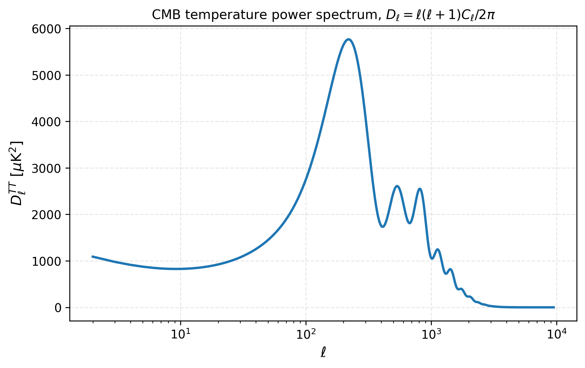

# API reference

All functions are importable from the top-level `classy_szlite` namespace.

## Parameter containers

```{eval-rst}
.. autoclass:: classy_szlite.CosmoParams
   :members:
```

```{eval-rst}
.. autoclass:: classy_szlite.ProfileParamsA10
   :members:
```

## Derived parameters

```{eval-rst}
.. autofunction:: classy_szlite.derived
```

## CMB angular power spectra

```{eval-rst}
.. autofunction:: classy_szlite.cl_TTTEEE
```



## Matter power spectrum

```{eval-rst}
.. autofunction:: classy_szlite.Pk
```

```{eval-rst}
.. autofunction:: classy_szlite.Pnl
```


## Distances

```{eval-rst}
.. autofunction:: classy_szlite.distances
```


## Halo-model tSZ Cl^yy

```{eval-rst}
.. autofunction:: classy_szlite.cl_yy
```

```{eval-rst}
.. autofunction:: classy_szlite.cl_yy_factory
```


## Utility

```{eval-rst}
.. autofunction:: classy_szlite.cosmo_to_dict
```
