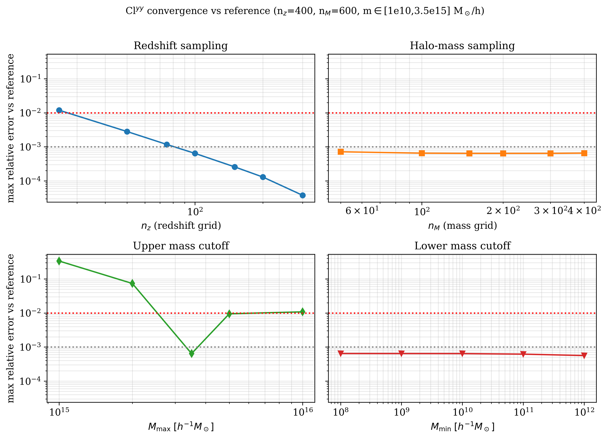

# Cl^yy convergence

`cl_yy` and `cl_yy_factory` integrate the halo model over redshift and
halo mass. Two discretisation grids (`n_z`, `n_m`) and two cut-offs
(`m_min`, `m_max`) drive the residual numerical error. The defaults are
chosen so that the total error is well below $10^{-3}$ — adequate for any
foreseeable bandpower covariance — but you may want tighter or looser
settings for forecasts vs. real data.

## What was measured

We compute
$\bigl(\Delta C_\ell^{yy}/C_\ell^{yy}\bigr)_{\max}$ across
$\ell \in [100, 8000]$ (12 log-spaced bins), using

- profile: Arnaud-10 with $(P_0=8.13,\,\beta=5.48,\,B=1.25)$
- cosmology: ede-v2 LCDM-equivalent (defaults)

against a **high-resolution reference** of $n_z = 400,\,n_M = 600,\,
M \in [10^{10},\,3.5\times10^{15}]\,M_\odot/h$.



## Numerical results

| `n_z` (n_m = 200)   | max $\lvert\Delta C/C\rvert$ |
| --- | --- |
|  25  |  1.2 × 10⁻² |
|  50  |  2.8 × 10⁻³ |
|  75  |  1.2 × 10⁻³ |
| **100** (default) | **6.4 × 10⁻⁴** |
| 150  |  2.6 × 10⁻⁴ |
| 200  |  1.3 × 10⁻⁴ |
| 300  |  3.8 × 10⁻⁵ |

| `n_m` (n_z = 100)   | max $\lvert\Delta C/C\rvert$ |
| --- | --- |
|  50  |  7.2 × 10⁻⁴ |
| 100  |  6.5 × 10⁻⁴ |
| 150  |  6.4 × 10⁻⁴ |
| **200** (default) | **6.4 × 10⁻⁴** |
| 300  |  6.4 × 10⁻⁴ |
| 400  |  6.5 × 10⁻⁴ |

`n_m` is **saturated by ~100**: the integrand decays steeply away from the
characteristic mass scale, so doubling the grid past that has no effect.

| $M_{\rm max}$ ($M_\odot/h$)   | max $\lvert\Delta C/C\rvert$ |
| --- | --- |
| 1 × 10¹⁵   |  3.4 × 10⁻¹  *(truncation, miss massive halos)* |
| 2 × 10¹⁵   |  7.4 × 10⁻²  *(truncation)* |
| **3.5 × 10¹⁵** (default) | **6.4 × 10⁻⁴** |
| 5 × 10¹⁵   |  9.5 × 10⁻³  *(slight extra discretisation error)* |
| 1 × 10¹⁶   |  1.1 × 10⁻²  *(slight extra discretisation error)* |

| $M_{\rm min}$ ($M_\odot/h$)   | max $\lvert\Delta C/C\rvert$ |
| --- | --- |
| 1 × 10⁸    |  6.4 × 10⁻⁴ |
| 1 × 10⁹    |  6.4 × 10⁻⁴ |
| **1 × 10¹⁰** (default) | **6.4 × 10⁻⁴** |
| 1 × 10¹¹   |  6.2 × 10⁻⁴  *(small structure in low-z 2-halo)* |
| 1 × 10¹²   |  5.6 × 10⁻⁴ |

`m_min` matters very little (low-mass halos contribute negligibly to tSZ).

## Recommended settings

| Use case | `n_z` | `n_m` | `m_min` | `m_max` | target accuracy |
| --- | --- | --- | --- | --- | --- |
| **MCMC / production** (default) | 100 | 200 | 1 × 10¹⁰ | 3.5 × 10¹⁵ | ≤ 10⁻³ |
| Fast forecast / pre-MCMC | 50  | 100 | 1 × 10¹⁰ | 3.5 × 10¹⁵ | ≤ 3 × 10⁻³ |
| Reference / cross-check | 300 | 200 | 1 × 10¹⁰ | 3.5 × 10¹⁵ | ≤ 10⁻⁴ |
| Quick smoke-test | 25  | 50  | 1 × 10¹⁰ | 3.5 × 10¹⁵ | ~ 1 × 10⁻² |

## Caveats and notes

- **Don't lower** $M_{\rm max}$ below $3 \times 10^{15}$: the massive
  end of the HMF still contributes a few percent to the 1-halo term.
- The seeming **rise** of the error for $M_{\rm max} \gtrsim 5\times10^{15}$
  is a discretisation artefact: the same $n_m$ has to span a much larger
  $\log M$ range, so the per-bin resolution drops. If you want a wider
  mass range, raise `n_m` proportionally.
- $\sigma(R)$ is computed via `mcfit.TophatVar`, which requires a
  uniformly **log-spaced** $k$ grid. The grid is hardcoded to match the
  ede-v2 emulator's $k$ range (down to $k=10^{-4}$ after low-$k$
  $k^{n_s}$ extrapolation), so there is no `k_min`/`k_max` knob to
  tune. The convergence above already accounts for this fixed grid.

## How to reproduce

```python
import numpy as np, jax.numpy as jnp
import classy_szlite as csl

cosmo = csl.CosmoParams()
profile = csl.ProfileParamsA10(P0=8.13, beta=5.48, B=1.25)
ell = jnp.geomspace(100, 8000, 12)

def total(**kw):
    c1, c2 = csl.cl_yy(cosmo, profile, ell, **kw)
    return np.asarray(c1 + c2)

ref = total(n_z=400, n_m=600)

for nz in [25, 50, 75, 100, 150, 200, 300]:
    cur = total(n_z=nz, n_m=200)
    err = np.max(np.abs(cur - ref) / np.abs(ref))
    print(f"n_z={nz:4d}  max |ΔC/C| = {err:.2e}")
```
