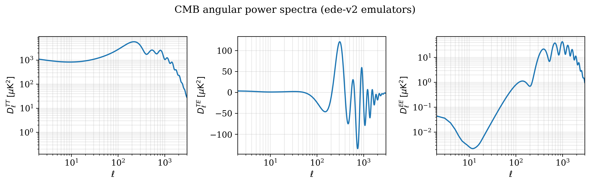
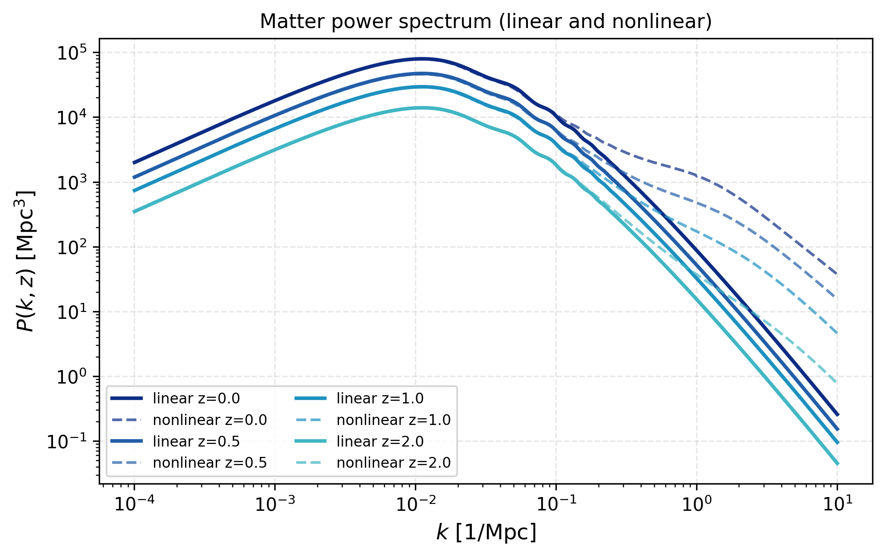
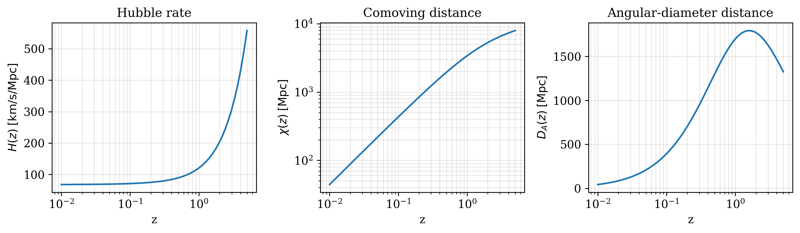
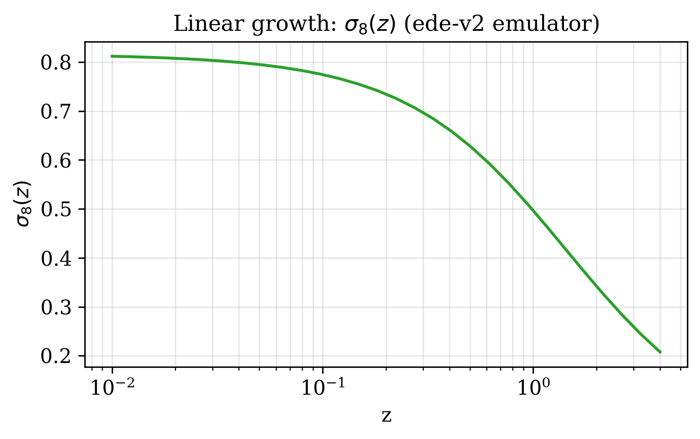
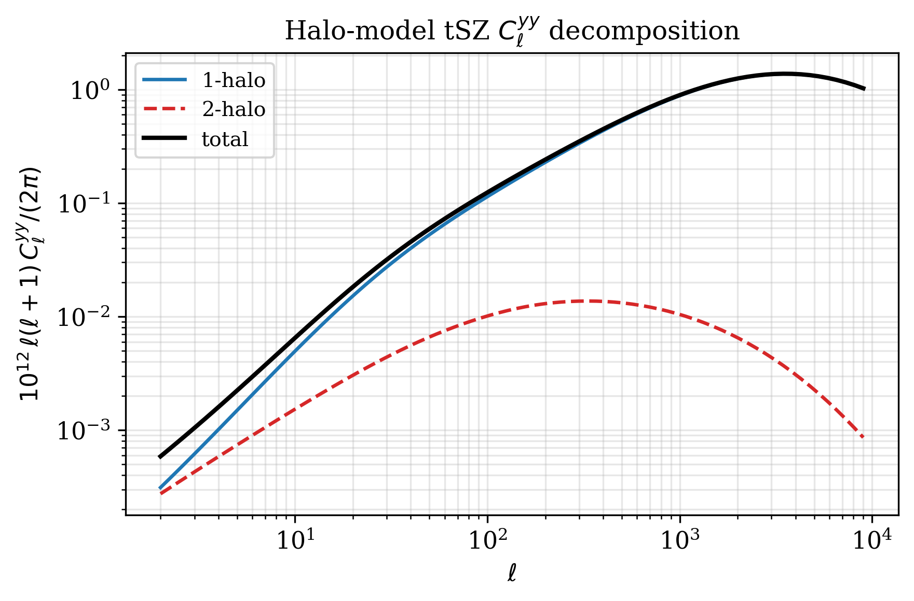
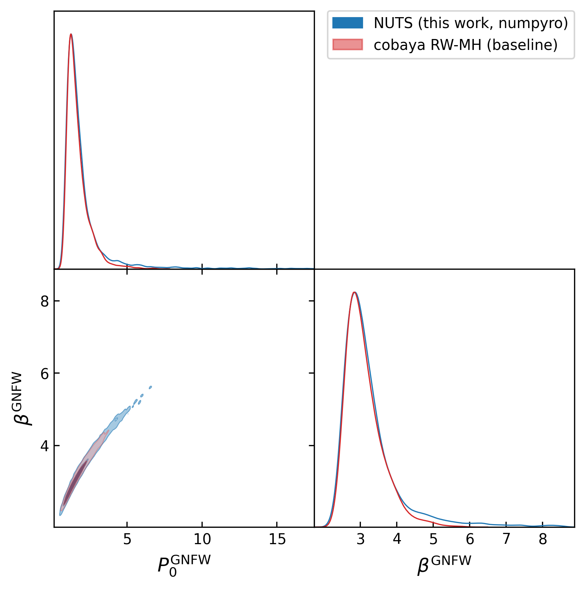
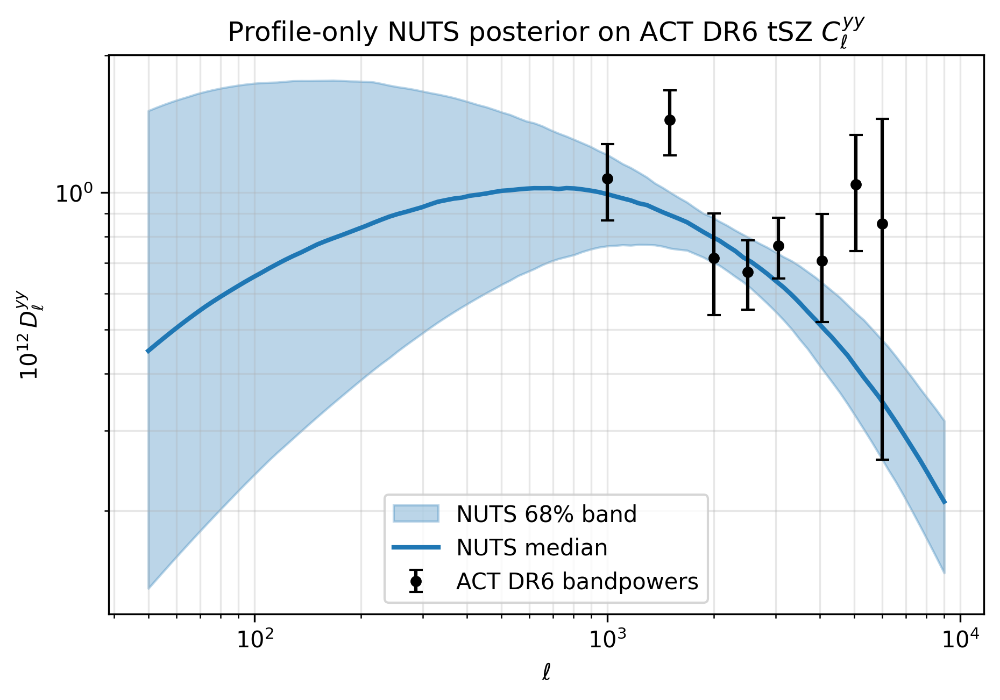

# Tutorials & examples

Each section pairs a runnable snippet with the figure it produces. All
examples assume:

```python
import jax, jax.numpy as jnp
jax.config.update("jax_enable_x64", True)
import numpy as np
import matplotlib.pyplot as plt
import classy_szlite as csl

cosmo = csl.CosmoParams()                      # Planck-18-ish defaults
```

## CMB angular power spectra

```python
cls = csl.cl_TTTEEE(cosmo, spectra=("tt", "te", "ee"))
T_CMB_uK2 = (2.7255e6) ** 2

fig, axes = plt.subplots(1, 3, figsize=(11, 3.3))
for ax, key, ylab, scale in [
    (axes[0], "tt", r"$D_\ell^{TT}\;[\mu K^2]$", "log"),
    (axes[1], "te", r"$D_\ell^{TE}\;[\mu K^2]$", "linear"),
    (axes[2], "ee", r"$D_\ell^{EE}\;[\mu K^2]$", "log"),
]:
    ax.plot(cls["ell"], cls[key] * T_CMB_uK2)
    ax.set(xscale="log", yscale=scale,
           xlabel=r"$\ell$", ylabel=ylab, xlim=(2, 3000))
    ax.grid(True, alpha=0.3, which="both")
fig.tight_layout()
```



## Matter Pk (linear + nonlinear)

```python
z_arr = jnp.array([0.0, 0.5, 1.0, 2.0])
k, pk  = csl.Pk(cosmo,  z_arr)
_, pnl = csl.Pnl(cosmo, z_arr)

fig, axes = plt.subplots(1, 2, figsize=(9, 3.5), sharey=True)
for i, z in enumerate(np.asarray(z_arr)):
    axes[0].loglog(k, pk[i],  label=f"z = {z}")
    axes[1].loglog(k, pnl[i], label=f"z = {z}")
axes[0].set(xlabel=r"$k\;[h/\mathrm{Mpc}]$", ylabel=r"$P(k)\;[(\mathrm{Mpc}/h)^3]$",
            title="Linear")
axes[1].set(xlabel=r"$k\;[h/\mathrm{Mpc}]$", title="Non-linear (HMcode)")
for ax in axes:
    ax.grid(True, which="both", alpha=0.3); ax.legend()
fig.tight_layout()
```



## Cosmological distances

```python
z = jnp.geomspace(0.01, 5.0, 60)
Hz, chi, Da = csl.distances(cosmo, z)
c = 299_792.458

fig, axes = plt.subplots(1, 3, figsize=(11, 3.3))
axes[0].semilogx(z, np.asarray(Hz) * c)
axes[0].set(xlabel="z", ylabel=r"$H(z)\;[\mathrm{km/s/Mpc}]$", title="Hubble rate")
axes[1].loglog(z, chi)
axes[1].set(xlabel="z", ylabel=r"$\chi(z)\;[\mathrm{Mpc}]$", title="Comoving distance")
axes[2].semilogx(z, Da)
axes[2].set(xlabel="z", ylabel=r"$D_A(z)\;[\mathrm{Mpc}]$",
            title="Angular-diameter distance")
for ax in axes: ax.grid(True, alpha=0.3, which="both")
fig.tight_layout()
```



## Linear growth σ₈(z)

Using the linear $P_k$ amplitude as a fixed-shape proxy:

```python
z = jnp.geomspace(0.01, 4.0, 30)
k, pk = csl.Pk(cosmo, z)
sigma8_0 = csl.derived(cosmo)["sigma_8"]
amp = np.sqrt(np.trapezoid(pk, k, axis=1))
sigma8_z = sigma8_0 * amp / amp[0]

plt.plot(z, sigma8_z); plt.xscale("log")
plt.xlabel("z"); plt.ylabel(r"$\sigma_8(z)$"); plt.grid(True, alpha=0.3, which="both")
```



## Halo-model tSZ Cl^yy (1h + 2h decomposition)

```python
profile = csl.ProfileParamsA10(P0=8.13, beta=5.48, B=1.25)
ell = jnp.geomspace(2, 9000, 80)
cl_1h, cl_2h = csl.cl_yy(cosmo, profile, ell)

prefac = np.asarray(ell * (ell + 1) / (2 * np.pi)) * 1e12
plt.loglog(ell, prefac * cl_1h,         label="1-halo")
plt.loglog(ell, prefac * cl_2h,         label="2-halo", ls="--")
plt.loglog(ell, prefac * (cl_1h+cl_2h), label="total", color="k", lw=2)
plt.xlabel(r"$\ell$"); plt.ylabel(r"$10^{12}\,\ell(\ell+1)C_\ell^{yy}/(2\pi)$")
plt.grid(True, alpha=0.3, which="both"); plt.legend()
```



For the dependence on `n_z`, `n_m`, `m_min`, `m_max`, see the
[convergence study](convergence.md).

## NUTS sampling of profile parameters

The factory closure makes Hamiltonian-style samplers — NUTS, HMC, NeuTra
— a natural fit: each leapfrog step is one ~5 ms forward pass, gradients
are exact via `jax.grad`, and there is no proposal-covariance tuning.
Here we reproduce the cobaya RW-MH baseline from the `Cl^yy` paper
(P₀ and β only, ACT-DR6 bandpowers) with NumPyro NUTS in a few seconds.

```python
import jax, jax.numpy as jnp
jax.config.update("jax_enable_x64", True)
import numpy as np, numpyro, numpyro.distributions as dist
from numpyro.infer import MCMC, NUTS
import classy_szlite as csl

# Bandpowers, covariance, ell grid
ell, y, cov = load_act_dr6_bandpowers()              # (8,) (8,) (8,8)
inv_cov     = jnp.asarray(np.linalg.inv(cov))

# Factory closure: one-shot CosmoGrids + HaloGrids
cosmo     = csl.CosmoParams(omega_b=0.0226, omega_cdm=0.118, H0=68.22,
                            tau_reio=0.0561, ln10_10_As=3.06, n_s=0.9743)
ev        = csl.cl_yy_factory(cosmo, jnp.asarray(ell))
dl_factor = jnp.asarray(ell * (ell + 1) / (2 * np.pi) * 1e12)

def model():
    P0   = numpyro.sample("P0",   dist.Uniform(0.0, 20.0))
    beta = numpyro.sample("beta", dist.Uniform(0.0, 10.0))
    prof = csl.ProfileParamsA10(
        P0=P0, c500=1.156, gamma=0.3292, alpha=1.062, beta=beta, B=1.25,
    )
    cl_1h, cl_2h = ev(prof)
    mu = dl_factor * (cl_1h + cl_2h)
    resid = jnp.asarray(y) - mu
    numpyro.factor("loglike", -0.5 * (resid @ inv_cov @ resid))

mcmc = MCMC(NUTS(model, target_accept_prob=0.85, dense_mass=True),
            num_warmup=500, num_samples=2000, num_chains=4)
mcmc.run(jax.random.PRNGKey(0))
mcmc.print_summary()
```

Output on a laptop (single-thread JAX, sequential chains):

```
NUTS done in 63.7 s — 8000 samples × 4 chains (126 samples/s)

                mean       std    median      5.0%     95.0%     n_eff    r_hat
        P0      2.03      1.79      1.56      0.61      3.23    389.50    1.01
      beta      3.25      0.85      3.04      2.27      4.17    447.55    1.01

Number of divergences: 0
```

Same posterior as the cobaya RW-MH baseline (P₀ = 1.71 ± 0.78, β = 3.10 ± 0.52),
but with **zero divergences**, no proposal-covariance hand-tuning, and an
order-of-magnitude better effective-sample-rate per evaluation.



Drawing 500 random posterior samples and overlaying the model band on the
data:



The full runnable script (including the data loader and plot code) is at
[`examples/nuts_clyy_profile.py`](https://github.com/CLASS-SZ/classy_szlite/blob/main/examples/nuts_clyy_profile.py).

## End-to-end MCMC pattern (cobaya Theory)

For the RW-MH cobaya baseline that the NUTS example above reproduces,
the natural cobaya `Theory` shape is:

```python
from cobaya.theory import Theory
import classy_szlite as csl
import numpy as np, jax, jax.numpy as jnp
jax.config.update("jax_enable_x64", True)

class MyTSZTheory(Theory):
    # The standard 6 cosmology parameters — fixed for this Theory
    omega_b:    float = 0.0226
    omega_cdm:  float = 0.118
    H0:         float = 68.22
    tau_reio:   float = 0.0561
    ln10_10_As: float = 3.06
    n_s:        float = 0.9743

    multipoles_file: str = None       # required: 1 ell per line

    params = {"P0GNFW": 8.13, "c500": 1.156, "gammaGNFW": 0.3292,
              "alphaGNFW": 1.062, "betaGNFW": 5.48, "B": 1.25}

    def initialize(self):
        ell = jnp.asarray(np.loadtxt(self.multipoles_file))
        cosmo = csl.CosmoParams(
            omega_b=self.omega_b, omega_cdm=self.omega_cdm,
            H0=self.H0, tau_reio=self.tau_reio,
            ln10_10_As=self.ln10_10_As, n_s=self.n_s,
        )
        self._csl = csl
        self._eval = csl.cl_yy_factory(cosmo, ell)   # heavy work, done once
        self._ell_np = np.asarray(ell)
        self._dl_factor = ell * (ell + 1) / (2 * jnp.pi) * 1e12

    def get_can_provide(self): return ["Cl_sz"]

    def calculate(self, state, want_derived=True, **p):
        prof = self._csl.ProfileParamsA10(
            P0=p["P0GNFW"], c500=p["c500"],
            gamma=p["gammaGNFW"], alpha=p["alphaGNFW"],
            beta=p["betaGNFW"], B=p["B"],
        )
        cl1, cl2 = self._eval(prof)
        state["Cl_sz"] = {
            "ell": self._ell_np,
            "1h":  np.asarray(self._dl_factor * cl1),
            "2h":  np.asarray(self._dl_factor * cl2),
        }

    def get_Cl_sz(self):
        return self._current_state["Cl_sz"]
```

A complete worked example with this `MyTSZTheory` paired with a Gaussian
likelihood (ACT-DR6 may26 setup) converges in **~2 min wall** for
~10,000 samples (R−1 = 0.008, 4-way MPI, `Rminus1_stop = 0.01`).

## Cosmology scan

```python
import classy_szlite as csl
import numpy as np

omega_cdm_vals = np.linspace(0.10, 0.14, 5)
for omega_cdm in omega_cdm_vals:
    cosmo = csl.CosmoParams(omega_cdm=float(omega_cdm))
    d = csl.derived(cosmo)
    print(f"omega_cdm = {omega_cdm:.3f}  →  σ8 = {d['sigma_8']:.4f}, "
          f"Ω_m = {d['Omega_m']:.4f}")
```

## Exploring EDE space

The `v2` emulator suite spans early-dark-energy parameter space; set
`fEDE`, `log10z_c`, `thetai_scf` to non-default values to leave the
LCDM-equivalent point:

```python
ede_cosmo = csl.CosmoParams(
    fEDE=0.10, log10z_c=3.5, thetai_scf=2.83,
)
csl.derived(ede_cosmo)
# → σ8 drops as fEDE rises (more EDE → less time for growth)
```

## Pre-compiling a forward + gradient function

For a parameter-inference pipeline that calls both the forward and the
gradient many times, JAX naturally caches the compiled trace:

```python
import jax, jax.numpy as jnp
import classy_szlite as csl

cosmo = csl.CosmoParams()
ell = jnp.geomspace(2, 9000, 80)
ev = csl.cl_yy_factory(cosmo, ell)

def D_ell(P0, beta):
    profile = csl.ProfileParamsA10(P0=P0, beta=beta, B=1.25)
    cl1, cl2 = ev(profile)
    return ell * (ell + 1) / (2 * jnp.pi) * (cl1 + cl2) * 1e12

dl     = D_ell(8.13, 5.48)                                                       # ~5 ms
g_P0   = jax.grad(lambda P0, b: jnp.sum(D_ell(P0, b)), argnums=0)(8.13, 5.48)    # ~17 ms warm
g_beta = jax.grad(lambda P0, b: jnp.sum(D_ell(P0, b)), argnums=1)(8.13, 5.48)
```
