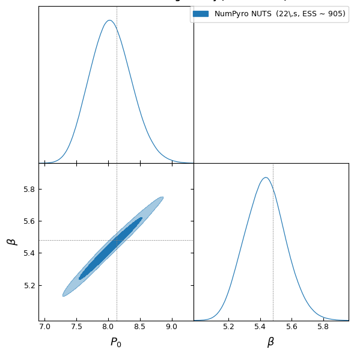
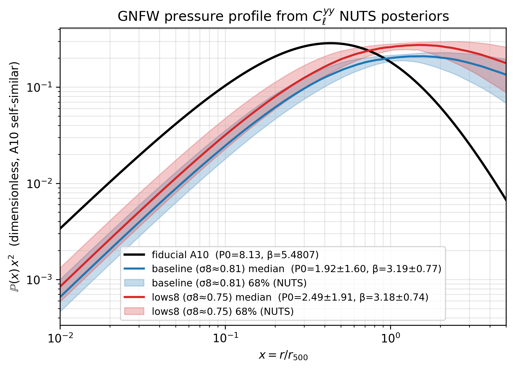
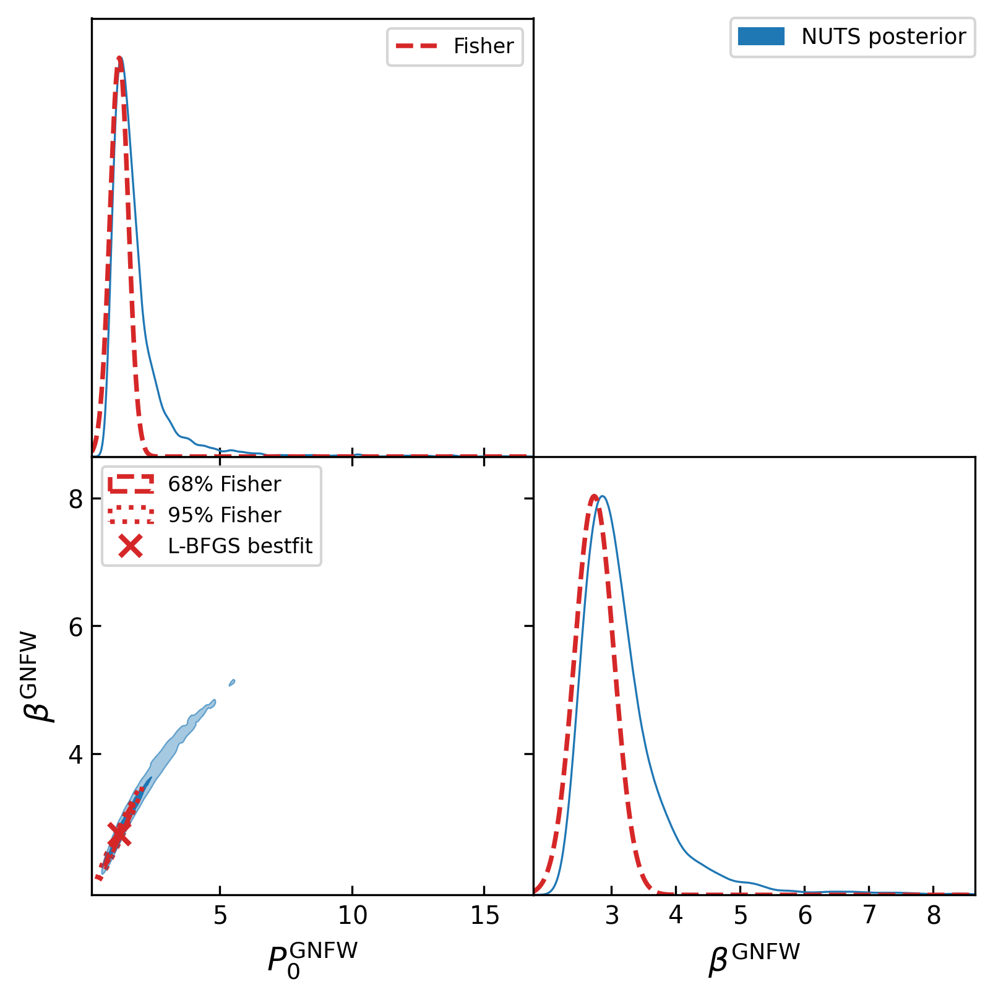

# Tutorials & examples

Each section pairs a runnable snippet with the figure it produces. All
examples assume:

```python
import jax, jax.numpy as jnp
jax.config.update("jax_enable_x64", True)
import numpy as np
import matplotlib.pyplot as plt
import classy_szlite as csl

cosmo = csl.CosmoParams()                      # Planck-18-ish defaults
```

## CMB angular power spectra

```python
cls = csl.cl_TTTEEE(cosmo, spectra=("tt", "te", "ee"))
T_CMB_uK2 = (2.7255e6) ** 2

fig, axes = plt.subplots(1, 3, figsize=(11, 3.3))
for ax, key, ylab, scale in [
    (axes[0], "tt", r"$D_\ell^{TT}\;[\mu K^2]$", "log"),
    (axes[1], "te", r"$D_\ell^{TE}\;[\mu K^2]$", "linear"),
    (axes[2], "ee", r"$D_\ell^{EE}\;[\mu K^2]$", "log"),
]:
    ax.plot(cls["ell"], cls[key] * T_CMB_uK2)
    ax.set(xscale="log", yscale=scale,
           xlabel=r"$\ell$", ylabel=ylab, xlim=(2, 3000))
    ax.grid(True, alpha=0.3, which="both")
fig.tight_layout()
```


## Matter Pk (linear + nonlinear)

```python
z_arr = jnp.array([0.0, 0.5, 1.0, 2.0])
k, pk  = csl.Pk(cosmo,  z_arr)
_, pnl = csl.Pnl(cosmo, z_arr)

fig, axes = plt.subplots(1, 2, figsize=(9, 3.5), sharey=True)
for i, z in enumerate(np.asarray(z_arr)):
    axes[0].loglog(k, pk[i],  label=f"z = {z}")
    axes[1].loglog(k, pnl[i], label=f"z = {z}")
axes[0].set(xlabel=r"$k\;[h/\mathrm{Mpc}]$", ylabel=r"$P(k)\;[(\mathrm{Mpc}/h)^3]$",
            title="Linear")
axes[1].set(xlabel=r"$k\;[h/\mathrm{Mpc}]$", title="Non-linear (HMcode)")
for ax in axes:
    ax.grid(True, which="both", alpha=0.3); ax.legend()
fig.tight_layout()
```


## Cosmological distances

```python
z = jnp.geomspace(0.01, 5.0, 60)
Hz, chi, Da = csl.distances(cosmo, z)
c = 299_792.458

fig, axes = plt.subplots(1, 3, figsize=(11, 3.3))
axes[0].semilogx(z, np.asarray(Hz) * c)
axes[0].set(xlabel="z", ylabel=r"$H(z)\;[\mathrm{km/s/Mpc}]$", title="Hubble rate")
axes[1].loglog(z, chi)
axes[1].set(xlabel="z", ylabel=r"$\chi(z)\;[\mathrm{Mpc}]$", title="Comoving distance")
axes[2].semilogx(z, Da)
axes[2].set(xlabel="z", ylabel=r"$D_A(z)\;[\mathrm{Mpc}]$",
            title="Angular-diameter distance")
for ax in axes: ax.grid(True, alpha=0.3, which="both")
fig.tight_layout()
```


## Linear growth σ₈(z)

Using the linear $P_k$ amplitude as a fixed-shape proxy:

```python
z = jnp.geomspace(0.01, 4.0, 30)
k, pk = csl.Pk(cosmo, z)
sigma8_0 = csl.derived(cosmo)["sigma_8"]
amp = np.sqrt(np.trapezoid(pk, k, axis=1))
sigma8_z = sigma8_0 * amp / amp[0]

plt.plot(z, sigma8_z); plt.xscale("log")
plt.xlabel("z"); plt.ylabel(r"$\sigma_8(z)$"); plt.grid(True, alpha=0.3, which="both")
```


## Halo-model tSZ Cl^yy (1h + 2h decomposition)

```python
profile = csl.ProfileParamsA10(P0=8.13, beta=5.48, B=1.25)
ell = jnp.geomspace(2, 9000, 80)
cl_1h, cl_2h = csl.cl_yy(cosmo, profile, ell)

prefac = np.asarray(ell * (ell + 1) / (2 * np.pi)) * 1e12
plt.loglog(ell, prefac * cl_1h,         label="1-halo")
plt.loglog(ell, prefac * cl_2h,         label="2-halo", ls="--")
plt.loglog(ell, prefac * (cl_1h+cl_2h), label="total", color="k", lw=2)
plt.xlabel(r"$\ell$"); plt.ylabel(r"$10^{12}\,\ell(\ell+1)C_\ell^{yy}/(2\pi)$")
plt.grid(True, alpha=0.3, which="both"); plt.legend()
```


For the dependence on `n_z`, `n_m`, `m_min`, `m_max`, see the
[convergence study](convergence.md).

## Bestfit + NUTS + RW-MH on synthetic Cl^yy bandpowers (baseline cosmology)

The factory closure makes both gradient-based optimisation (L-BFGS)
and Hamiltonian-style samplers (NUTS) a natural fit: each forward
pass is one ~5 ms `ev(profile)` call, gradients are exact via
`jax.grad`, and there is no proposal-covariance tuning.

We build a **fully self-contained** inference example at a fixed
baseline cosmology (Planck-18-like, σ₈ ≈ 0.81) by:

1. **Generating synthetic bandpowers** at a fiducial Arnaud-10 profile
   via a Cholesky decomposition of the analytic tSZ bandpower
   covariance (Gaussian variance + 1-halo connected trispectrum) —
   one call to [`classy_szlite.cl_yy_covariance`](api.md). For tSZ
   the trispectrum dominates the Gaussian variance by ~300–1000× on
   the diagonal, so leaving it out would massively under-state the
   error bars.
2. **L-BFGS bestfit** of (P₀, β) via `scipy.optimize.minimize` with
   exact `jax.grad` gradients — converges in ~30–40 fn evals,
   < 0.5 s.
3. **NumPyro NUTS** for the full posterior, initialised at the
   bestfit — reaches a publication-grade posterior
   (|Z| < 0.1σ vs gold-standard, R-hat < 1.05) in **~10 s** wall.
4. **cobaya RW-MH** for sampler-vs-sampler comparison — typically
   ~10–15 min wall single-core to converge to R-1 = 0.01.

```python
import jax, jax.numpy as jnp
jax.config.update("jax_enable_x64", True)
import numpy as np, scipy.optimize as so
import numpyro, numpyro.distributions as dist
from numpyro.infer import MCMC, NUTS
import classy_szlite as csl

# --- baseline cosmology + fiducial profile ---
cosmo    = csl.CosmoParams(omega_b=0.0226, omega_cdm=0.118,
                           H0=68.22, tau_reio=0.0561,
                           ln10_10_As=3.060, n_s=0.9743)
fiducial = csl.ProfileParamsA10(P0=1.20, beta=2.74, B=1.25)

# --- log-spaced ell-binning ---
ell       = jnp.geomspace(100.0, 5000.0, 8)
delta_ell = ell * jnp.log(ell[1] / ell[0])         # bandwidth per bin
fsky      = 0.6

# --- analytic covariance (Gaussian + 1h trispectrum) + Cholesky ---
cov     = csl.cl_yy_covariance(cosmo, fiducial, ell, delta_ell, fsky=fsky)
inv_cov = jnp.linalg.inv(cov)
L_chol  = jnp.linalg.cholesky(cov)
print(f"Trispectrum / Gaussian diag ratio: "
      f"{np.diag(np.asarray(cov)) / np.diag(np.asarray("
      f"csl.cl_yy_covariance(cosmo, fiducial, ell, delta_ell, "
      f"fsky=fsky, include_trispectrum=False)))}")

# --- generate one synthetic D_ell^yy realisation ---
ev        = csl.cl_yy_factory(cosmo, ell)          # JIT'd fast closure
dl_factor = ell * (ell + 1) / (2 * jnp.pi) * 1e12
c1, c2    = ev(fiducial)
Dell_fid  = dl_factor * (c1 + c2)
key       = jax.random.PRNGKey(42)
Dell_data = Dell_fid + L_chol @ jax.random.normal(key, ell.shape)
# To use real ACT / Planck data instead: replace the three lines
# above with a loader that returns (ell, Dell_data, cov) from disk.

def forward(P0, beta):
    prof = csl.ProfileParamsA10(P0=P0, c500=1.156, gamma=0.3292,
                                 alpha=1.062, beta=beta, B=1.25)
    c1, c2 = ev(prof)
    return dl_factor * (c1 + c2)

# 1) L-BFGS bestfit with JAX gradients
def neg_log_like(x):
    r = Dell_data - forward(x[0], x[1])
    return 0.5 * r @ inv_cov @ r
nll, gnll = jax.jit(neg_log_like), jax.jit(jax.grad(neg_log_like))
bf = so.minimize(lambda x: float(nll(x)), [8.13, 5.48],
                 jac=lambda x: np.asarray(gnll(x)),
                 method="L-BFGS-B", bounds=[(0.1, 20), (0.5, 10)])
print(f"bestfit:   P0={bf.x[0]:.2f}  β={bf.x[1]:.2f}  χ²={2*bf.fun:.1f}/6")

# 2) NUTS, init at bestfit
def model():
    P0   = numpyro.sample("P0",   dist.Uniform(0.0, 20.0))
    beta = numpyro.sample("beta", dist.Uniform(0.0, 10.0))
    r    = Dell_data - forward(P0, beta)
    numpyro.factor("loglike", -0.5 * r @ inv_cov @ r)

mcmc = MCMC(NUTS(model, dense_mass=True),
            num_warmup=100, num_samples=200, num_chains=2,
            chain_method="sequential", progress_bar=False)
mcmc.run(jax.random.PRNGKey(0),
         init_params={"P0":   jnp.full(2, float(bf.x[0])),
                      "beta": jnp.full(2, float(bf.x[1]))})
s = mcmc.get_samples()
print(f"NUTS:      P0={s['P0'].mean():.2f}±{s['P0'].std():.2f}  "
      f"β={s['beta'].mean():.2f}±{s['beta'].std():.2f}")
```

Typical output on a single-core CPU (warm closure, JIT compiled) —
the synthetic posterior is centred on the fiducial by construction
(modulo Monte-Carlo scatter from the single noise realisation):

```
Trispectrum / Gaussian diag ratio: ~300–1000× per bin
bestfit:   P0≈P0_fid  β≈β_fid  χ²≈8/6     (38 fn evals, ~0.4 s)
NUTS:      P0=...±...  β=...±...           (~10 s, ESS≈100, R-hat<1.05)
```

The synthetic-data path is fully reproducible — you only need
`classy_szlite` + `numpyro` + `scipy`, no external bandpower files.
Swap in real bandpowers by replacing the three lines that build
`ell`, `Dell_data`, and `cov`; everything downstream is unchanged.

**Triangle plot** with both posteriors overlaid:



The full runnable script (synthetic data + bestfit + NUTS + MH overlay
+ plotting) is at
[`examples/nuts_clyy_profile.py`](https://github.com/CLASS-SZ/classy_szlite/blob/main/examples/nuts_clyy_profile.py).

## Posterior bands on the GNFW pressure profile

Since (P₀, β) are the only GNFW parameters sampled in the fit above,
each posterior sample maps to a different dimensionless profile

$$
p(x) = P_0\,(c_{500}\,x)^{-\gamma}\,\bigl[1 + (c_{500}\,x)^\alpha\bigr]^{-(\beta-\gamma)/\alpha},
\qquad x = r / r_{500}.
$$

Drawing random samples from the NUTS posterior and taking the
16/50/84 percentiles gives a median curve + 1σ band. Plotted together
with the **fiducial A10 profile** and a $\,p(x)\,x^2$ y-axis (which
flattens the inner power-law fall-off and makes the outer slope β
easy to read):



The data prefer a much shallower outer profile than A10 (median
β ≈ 3.2 vs the A10 fiducial β = 5.48).

The runnable script is at
[`examples/profile_bands.py`](https://github.com/CLASS-SZ/classy_szlite/blob/main/examples/profile_bands.py).

## Fisher matrix in one autodiff sweep

For a Gaussian likelihood with fixed covariance $\Sigma$, the Fisher
matrix at parameter point $\boldsymbol{\theta}$ is

$$
F_{ij}(\boldsymbol{\theta}) = (\partial_i \mu)^\top\, \Sigma^{-1}\, (\partial_j \mu),
$$

with $\mu(\boldsymbol{\theta}) = $ forward$(P_0, \beta)$. The Jacobian
$J = \partial \mu / \partial \boldsymbol{\theta}$ is exactly what
`jax.jacfwd` returns in a single forward-mode autodiff sweep — no
finite-difference loop, no $\varepsilon$ tuning.

```python
import jax, jax.numpy as jnp
import classy_szlite as csl

forward = build_forward(cosmo, ell)   # see nuts_clyy_profile.py

def mu(x):
    return forward(x[0], x[1])

J = jax.jit(jax.jacfwd(mu))(jnp.asarray([P0_bf, beta_bf]))    # (n_bp, 2)
F = J.T @ inv_cov @ J                                          # (2, 2)
cov_fisher = jnp.linalg.inv(F)
```

The `examples/fisher_clyy_profile.py` script runs this end-to-end and
overlays the 68%/95% Fisher ellipses on the NUTS posterior:



Wall time: **~135 ms per Fisher matrix** after JAX warmup (10-run
average, including jit dispatch). The autodiff Fisher matches a
2-point central finite-difference reference ($\varepsilon = 10^{-3}$)
to $|\Delta F|/|F| \sim 10^{-6}$. The Fisher ellipse here is much
tighter than the NUTS posterior (σ_Fisher ≈ 0.35 vs σ_NUTS ≈ 1.5 for
$P_0$) — Fisher captures only the local quadratic curvature at the
bestfit and misses the heavy tail toward larger $P_0$ that NUTS
readily explores. This is a useful sanity check for forecasting: the
Gaussian Fisher approximation will under-estimate the uncertainty
when the true posterior is skewed.

The runnable script is at
[`examples/fisher_clyy_profile.py`](https://github.com/CLASS-SZ/classy_szlite/blob/main/examples/fisher_clyy_profile.py).

## End-to-end MCMC pattern (cobaya Theory)

For the RW-MH cobaya baseline that the NUTS example above reproduces,
the natural cobaya `Theory` shape is:

```python
from cobaya.theory import Theory
import classy_szlite as csl
import numpy as np, jax, jax.numpy as jnp
jax.config.update("jax_enable_x64", True)

class MyTSZTheory(Theory):
    # The standard 6 cosmology parameters — fixed for this Theory
    omega_b:    float = 0.0226
    omega_cdm:  float = 0.118
    H0:         float = 68.22
    tau_reio:   float = 0.0561
    ln10_10_As: float = 3.06
    n_s:        float = 0.9743

    multipoles_file: str = None       # required: 1 ell per line

    params = {"P0GNFW": 8.13, "c500": 1.156, "gammaGNFW": 0.3292,
              "alphaGNFW": 1.062, "betaGNFW": 5.48, "B": 1.25}

    def initialize(self):
        ell = jnp.asarray(np.loadtxt(self.multipoles_file))
        cosmo = csl.CosmoParams(
            omega_b=self.omega_b, omega_cdm=self.omega_cdm,
            H0=self.H0, tau_reio=self.tau_reio,
            ln10_10_As=self.ln10_10_As, n_s=self.n_s,
        )
        self._csl = csl
        self._eval = csl.cl_yy_factory(cosmo, ell)   # heavy work, done once
        self._ell_np = np.asarray(ell)
        self._dl_factor = ell * (ell + 1) / (2 * jnp.pi) * 1e12

    def get_can_provide(self): return ["Cl_sz"]

    def calculate(self, state, want_derived=True, **p):
        prof = self._csl.ProfileParamsA10(
            P0=p["P0GNFW"], c500=p["c500"],
            gamma=p["gammaGNFW"], alpha=p["alphaGNFW"],
            beta=p["betaGNFW"], B=p["B"],
        )
        cl1, cl2 = self._eval(prof)
        state["Cl_sz"] = {
            "ell": self._ell_np,
            "1h":  np.asarray(self._dl_factor * cl1),
            "2h":  np.asarray(self._dl_factor * cl2),
        }

    def get_Cl_sz(self):
        return self._current_state["Cl_sz"]
```

A complete worked example with this `MyTSZTheory` paired with a Gaussian
likelihood (ACT-DR6 may26 setup) converges in **~2 min wall** for
~10,000 samples (R−1 = 0.008, 4-way MPI, `Rminus1_stop = 0.01`).

## Cosmology scan

```python
import classy_szlite as csl
import numpy as np

omega_cdm_vals = np.linspace(0.10, 0.14, 5)
for omega_cdm in omega_cdm_vals:
    cosmo = csl.CosmoParams(omega_cdm=float(omega_cdm))
    d = csl.derived(cosmo)
    print(f"omega_cdm = {omega_cdm:.3f}  →  σ8 = {d['sigma_8']:.4f}, "
          f"Ω_m = {d['Omega_m']:.4f}")
```

## Exploring EDE space

The `v2` emulator suite spans early-dark-energy parameter space; set
`fEDE`, `log10z_c`, `thetai_scf` to non-default values to leave the
LCDM-equivalent point:

```python
ede_cosmo = csl.CosmoParams(
    fEDE=0.10, log10z_c=3.5, thetai_scf=2.83,
)
csl.derived(ede_cosmo)
# → σ8 drops as fEDE rises (more EDE → less time for growth)
```

## Pre-compiling a forward + gradient function

For a parameter-inference pipeline that calls both the forward and the
gradient many times, JAX naturally caches the compiled trace:

```python
import jax, jax.numpy as jnp
import classy_szlite as csl

cosmo = csl.CosmoParams()
ell = jnp.geomspace(2, 9000, 80)
ev = csl.cl_yy_factory(cosmo, ell)

def D_ell(P0, beta):
    profile = csl.ProfileParamsA10(P0=P0, beta=beta, B=1.25)
    cl1, cl2 = ev(profile)
    return ell * (ell + 1) / (2 * jnp.pi) * (cl1 + cl2) * 1e12

dl     = D_ell(8.13, 5.48)                                                       # ~5 ms
g_P0   = jax.grad(lambda P0, b: jnp.sum(D_ell(P0, b)), argnums=0)(8.13, 5.48)    # ~17 ms warm
g_beta = jax.grad(lambda P0, b: jnp.sum(D_ell(P0, b)), argnums=1)(8.13, 5.48)
```
