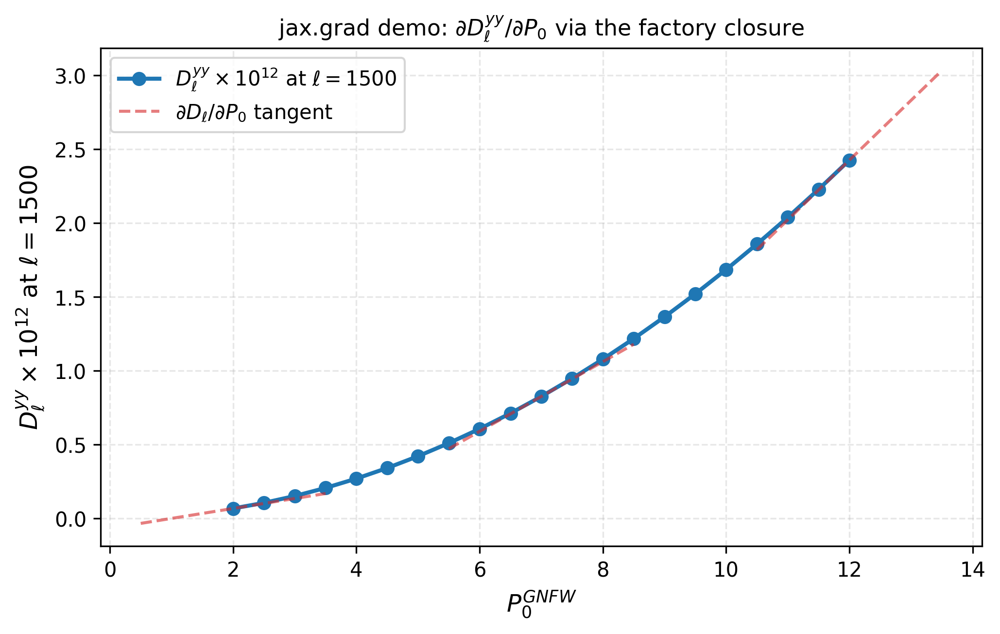

# JAX gradients

All public functions are JAX-traceable. Use `jax.grad`, `jax.jacfwd`,
`jax.jacrev`, `jax.vmap` as you would on any pure-JAX function. The
:class:`~classy_szlite.CosmoParams` and :class:`~classy_szlite.ProfileParamsA10`
NamedTuples are JAX pytrees — you can differentiate w.r.t. them directly.

## Gradient via the fast path (recommended)

For inference at fixed cosmology, the factory closure is the fastest way
to get gradients:

```python
import jax, jax.numpy as jnp
jax.config.update("jax_enable_x64", True)
import classy_szlite as csl

cosmo = csl.CosmoParams()
ell = jnp.geomspace(2, 5000, 30)
ev = csl.cl_yy_factory(cosmo, ell)

def loss(P0, beta):
    profile = csl.ProfileParamsA10(P0=P0, beta=beta, B=1.25)
    cl_1h, cl_2h = ev(profile)
    return jnp.sum(cl_1h + cl_2h)

g = jax.grad(loss, argnums=(0, 1))(8.13, 5.48)
```

Warm cost: **~17 ms / eval** (≈3× the ~5 ms forward pass — within the
expected reverse-mode autodiff overhead).

The figure shows D_ℓ^yy(P_0) at ℓ=1500 with `∂D_ℓ/∂P_0` tangent lines
overlaid at three values of P_0, computed via `jax.grad`:



## Gradient through the full pipeline

When you need gradients **w.r.t. cosmology**, use the full `cl_yy`
pipeline:

```python
def full_loss(omega_b, omega_cdm, P0, beta):
    c = csl.CosmoParams(omega_b=omega_b, omega_cdm=omega_cdm)
    profile = csl.ProfileParamsA10(P0=P0, beta=beta, B=1.25)
    cl_1h, cl_2h = csl.cl_yy(c, profile, ell)
    return jnp.sum(cl_1h + cl_2h)

g = jax.grad(full_loss, argnums=(0, 1, 2, 3))(0.0226, 0.118, 8.13, 5.48)
# d/d(omega_b), d/d(omega_cdm), d/dP0, d/dβ
```

First call is ~8 s (the autodiff trace triggers emulator JIT compilation
for the cosmology emulators); warm calls are ~50 ms.

## Gradient w.r.t. CosmoParams as a pytree

You can differentiate w.r.t. the whole `CosmoParams` container — the
gradient is returned as a `CosmoParams` with each field a `jax.Array`:

```python
def cl_loss(cosmo):
    profile = csl.ProfileParamsA10(P0=8.13, beta=5.48, B=1.25)
    cl_1h, cl_2h = csl.cl_yy(cosmo, profile, ell)
    return jnp.sum(cl_1h + cl_2h)

grads = jax.grad(cl_loss)(csl.CosmoParams())
print(f"d(loss)/d(omega_b)   = {float(grads.omega_b):.4e}")
print(f"d(loss)/d(omega_cdm) = {float(grads.omega_cdm):.4e}")
print(f"d(loss)/d(fEDE)      = {float(grads.fEDE):.4e}")
```

## Caveats

- **Don't wrap the factory closure in `jax.jit`** — internally it calls
  into `mcfit`'s `TophatVar` which is not fully jit-safe. The closure is
  already fast enough without it (~5 ms/call) and `jax.grad` works
  directly.
- For inference at fixed cosmology, the **factory path is preferred** —
  gradients are ~3× the forward pass (~17 ms) rather than ~50 ms through
  the full pipeline.
