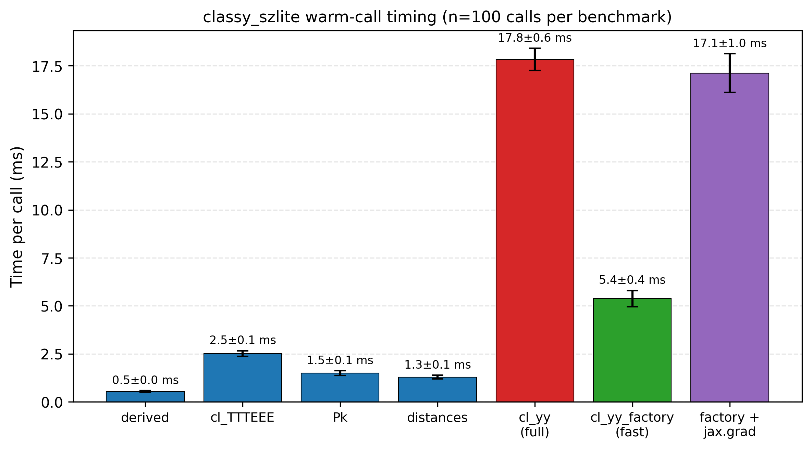

# Throughput

Measured on macOS arm64 (M-series CPU), single-thread JAX, 100 warm calls
per benchmark (cold runs discarded). Each call uses freshly randomised
parameters so the JAX cache reuses the compiled traces but the inputs
differ.



| Function | mean ± std (ms/call) | throughput (calls/s) |
| --- | --- | --- |
| `derived` (σ8, Ω_m, S8) | **0.54 ± 0.04** | 1850 ± 150 |
| `cl_TTTEEE` (TT, TE, EE) | **2.52 ± 0.14** | 400 ± 25 |
| `Pk` (linear, 4 z values) | **1.49 ± 0.12** | 670 ± 55 |
| `distances` (4 z values) | **1.29 ± 0.09** | 770 ± 60 |
| `cl_yy` (full pipeline) | **17.84 ± 0.58** | 56 ± 2 |
| `cl_yy_factory` (fixed-cosmo) | **5.38 ± 0.42** | 185 ± 15 |
| `cl_yy_factory` + `jax.grad` | **17.12 ± 1.01** | 58 ± 3 |

Notes:

- All numbers are **after** JAX warmup (cold first-call cost is ~1 s for
  the full Cl^yy pipeline; the factory's first call is ~5 ms after the
  one-time cosmology + halo-grid setup).
- For an MCMC sampling profile parameters at fixed cosmology, prefer
  `cl_yy_factory` — it skips the emulator + halo-grid rebuild that the
  full `cl_yy` redoes every call.
- Throughputs scale with the size of the ell array. Numbers above use
  8 bandpower ells (ACT-DR6-style). Larger ell arrays cost
  proportionally more for the Cl^yy integration but the same for the
  emulator + halo-grid setup.

## Reproduce

```python
import time, numpy as np
import jax.numpy as jnp
import classy_szlite as csl

cosmo = csl.CosmoParams()
ell = jnp.geomspace(1000, 6000, 8)
ev  = csl.cl_yy_factory(cosmo, ell)
rng = np.random.default_rng(0)

def bench(fn, n=100, skip=3):
    times = []
    for i in range(n + skip):
        t0 = time.perf_counter()
        out = fn()
        for o in (out if isinstance(out, tuple) else (out,)):
            if hasattr(o, "block_until_ready"):
                o.block_until_ready()
        if i >= skip:
            times.append((time.perf_counter() - t0) * 1e3)
    a = np.asarray(times)
    return a.mean(), a.std()

def call():
    P0 = float(rng.uniform(1, 12))
    beta = float(rng.uniform(3, 7))
    return ev(csl.ProfileParamsA10(P0=P0, beta=beta, B=1.25))

m, s = bench(call)
print(f"cl_yy_factory: {m:.2f} ± {s:.2f} ms/call  ({1e3/m:.0f} calls/s)")
```
